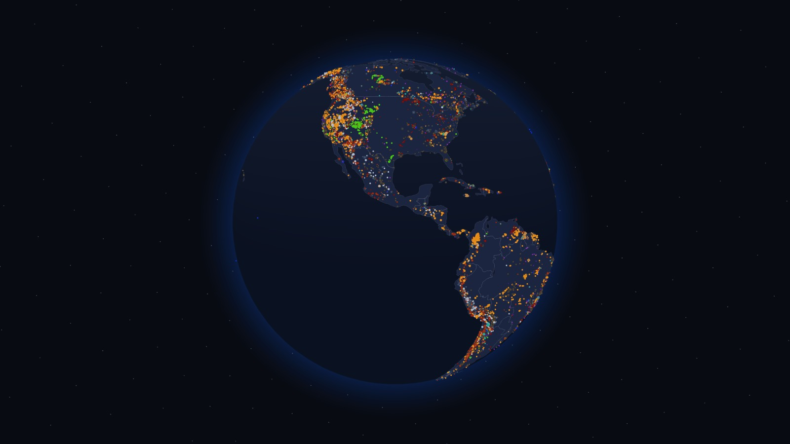

# Global Mineral Deposit Globe

An interactive 3D globe that plots the world's known mineral deposits as glowing,
commodity-colored points on a dark planet. Spin the Earth, filter by commodity, and click
any point to read a deposit's details. It's a static single-page app — no backend, no
database — so the whole thing runs from a folder of files.

**Live:** https://alexander-ai.github.io/global-deposit-globe/



## About

The globe renders **~89,000 deposits compiled from twelve open geological databases** —
USGS MRDS, the USGS world deposit catalogs (porphyry copper, rare earths, sediment Zn-Pb,
VMS) and Global Critical Minerals layer, USGS mineral operations outside the US, Geoscience
Australia, the USGS Mineral Industries of Africa, and Canada's NRCan 900A, BC MINFILE and
Saskatchewan SMDI. They're normalized into one uniform schema, classified into a fixed
14-commodity palette, and **de-duplicated across sources** so a mine catalogued in five
databases shows up as a single point (the detail card tells you how many databases
corroborate it). Each point is sized by recorded scale and colored by its primary commodity.

A note on honesty, because it matters here: this is a **historical and approximate**
picture, not a live feed. USGS stopped systematically updating MRDS in 2011, and because the
US was catalogued far more exhaustively than the rest of the world, raw deposit *counts* are
heavily US-biased — a data-availability artifact, not a reflection of where minerals are. The
app opens on a globally-balanced **Active** view (~36% US) and lets you switch to the full
historical set; the in-app "About the data" panel and the footer spell all of this out.

Rendering is a single GPU `THREE.Points` cloud (one draw call) with attribute-driven
filtering and animated transitions, so the globe holds 60fps even with tens of thousands of
points visible. Built with **Vite + React + TypeScript + react-globe.gl** (three.js).

## Develop

```bash
npm install
npm run dev        # dev server at http://localhost:5173
npm run build      # typecheck + production build to dist/
```

The deposit data ships pre-built in `public/deposits.json`. To regenerate it from source:

```bash
pip install -r requirements.txt
npm run prepare-data          # downloads sources, de-dups, writes public/deposits.json
pytest scripts/tests -q       # unit tests for the commodity classifier + dedup rules
python scripts/validate.py    # geographic-balance report + famous-deposit spot-checks
```

CI runs the build, the unit tests, and a strict spot-check gate on every push; merges to
`main` deploy automatically to GitHub Pages.

## Data & licensing

All sources are public-domain or open-licensed (USGS public domain, Geoscience Australia
CC-BY 4.0, Canadian Open Government Licence) so the merged dataset is redistributable.
Locations are historical and approximate. See the in-app **About the data** panel for the
full per-source attribution.
